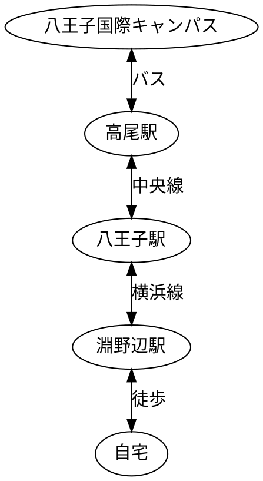

# 穂積の通学経路

[メンバー表に戻る](member.md#メンバー表)

```graphviz
digraph {
    edge [dir=both]
    八王子国際キャンパス -> 高尾駅 [label=バス]
    高尾駅 -> 八王子駅 [label=中央線]
    八王子駅 -> 淵野辺駅 [label=横浜線]
    淵野辺駅 -> 自宅[label=徒歩]
}

```
