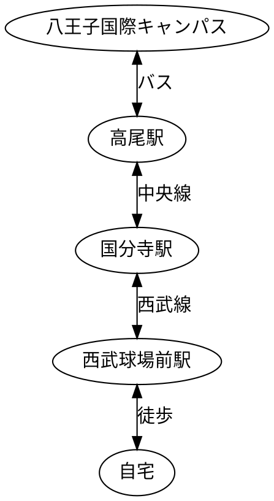

# 丸の通学経路

[メンバー表に戻る](member.md#メンバー表)

```graphviz
digraph {
    edge [dir=both]
     八王子国際キャンパス -> 高尾駅 [label=バス]
    高尾駅 -> 国分寺駅 [label=中央線]
    国分寺駅 -> 西武球場前駅 [label=西武線]
    西武球場前駅 -> 自宅 [label=徒歩]
}
```
